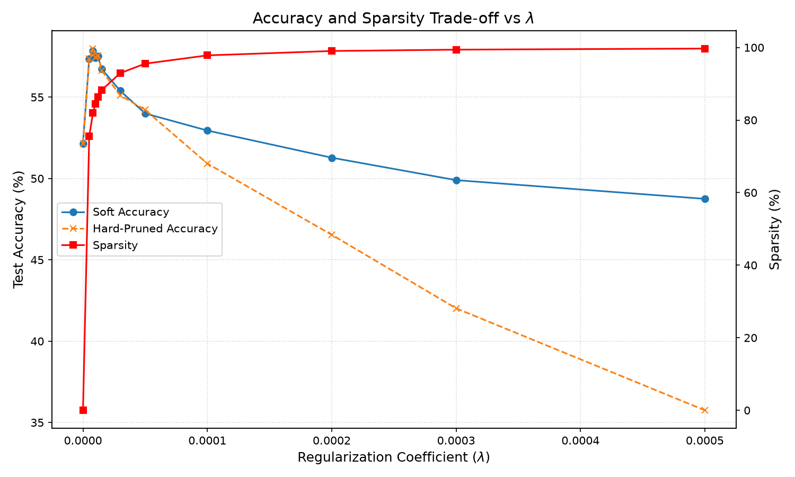
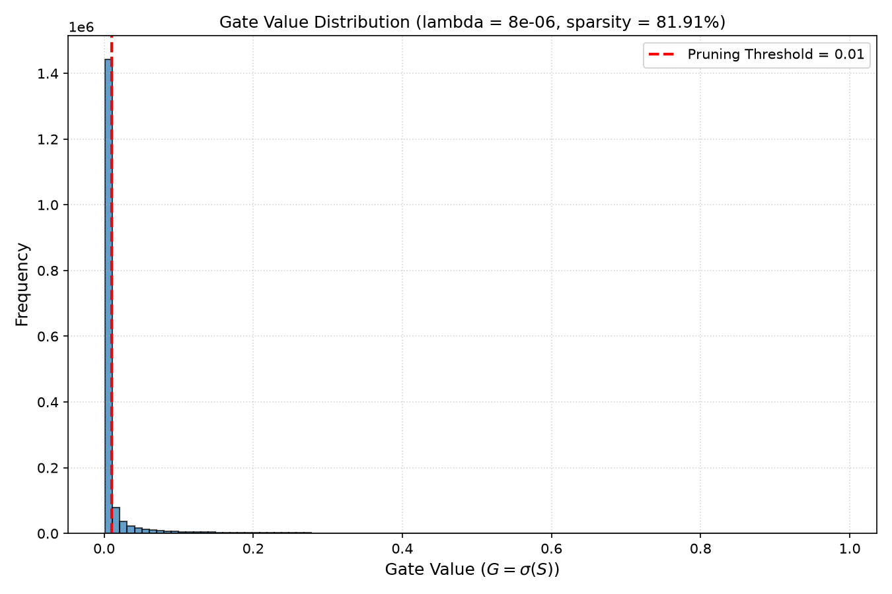

# Self-Pruning Neural Network: Final Report

## 1. Why an L1 Penalty on Sigmoid Gates Encourages Sparsity

In this architecture, each weight $W$ is multiplied by a learnable gate value $G = \sigma(S)$, where $S$ is a learnable gate-score parameter. The effective weight is therefore:

$$
W_{\text{pruned}} = W \odot G
$$

where $\odot$ denotes element-wise multiplication.

The training objective combines the standard classification loss with an L1 penalty on the gate values:

$$
L_{\text{total}} = L_{\text{CrossEntropy}} + \lambda \sum_i G_i
$$

Because the sigmoid output is always positive, the L1 norm of the gates is simply their sum.

### Mathematical Intuition

For a single gate,

$$
G = \sigma(S)
$$

and therefore:

$$
\frac{\partial G}{\partial S} = \sigma(S)(1-\sigma(S))
$$

The sparsity term contributes the gradient:

$$
\frac{\partial L_{\text{sparsity}}}{\partial S} = \lambda \sigma(S)(1-\sigma(S))
$$

This gradient is positive, so gradient descent applies a negative update to the gate score $S$. As a result, gates that are not sufficiently useful for classification are pushed toward smaller values.

The sigmoid itself does not produce an exact zero value. Instead, gates are considered effectively pruned when they fall below the selected pruning threshold of `0.01`.

Therefore, increasing $\lambda$ increases the pressure toward smaller gate values and generally produces a sparser network, although excessive regularization can remove connections that are important for classification.

---

## 2. Experimental Setup

The self-pruning network was evaluated on the CIFAR-10 image classification dataset.

### Network Architecture

The model is a feed-forward MLP with the following dimensions:

$$
3072 \rightarrow 512 \rightarrow 256 \rightarrow 128 \rightarrow 10
$$

Each fully connected layer is implemented using the custom `PrunableLinear` layer.

### Training Configuration

- **Dataset:** CIFAR-10
- **Architecture:** Self-Pruning MLP
- **Input size:** 3072
- **Hidden layers:** 512, 256, 128
- **Output classes:** 10
- **Optimizer:** Adam
- **Weight learning rate:** $1\times10^{-3}$
- **Gate learning rate:** $5\times10^{-3}$
- **Weight decay:** $1\times10^{-4}$
- **Training epochs:** 30
- **Pruning threshold:** 0.01
- **Loss:** Cross-Entropy + $\lambda$ × L1 Gate Penalty

The following values of $\lambda$ were evaluated:

$$
[0,\ 5e^{-6},\ 8e^{-6},\ 1e^{-5},\ 1.2e^{-5},\ 1.5e^{-5},\ 3e^{-5},\ 5e^{-5},\ 1e^{-4},\ 2e^{-4},\ 3e^{-4},\ 5e^{-4}]
$$

A weight is considered effectively pruned when its corresponding gate value is below `0.01`.

---

## 3. Sparsity vs. Accuracy Trade-off

The following table summarizes the results of the $\lambda$ sweep.

| Lambda ($\lambda$) | Test Accuracy (Soft) | Test Accuracy (Hard-Pruned) | Sparsity Level (%) | Active Parameters |
|:------------------:|:--------------------:|:---------------------------:|:------------------:|------------------:|
| 0 | 52.15% | 52.15% | 0.00% | 1,737,984 |
| 5e-06 | 57.37% | 57.36% | 75.55% | 424,881 |
| **8e-06** | **57.85%** | **57.99%** | **81.91%** | **314,321** |
| 1e-05 | 57.42% | 57.47% | 84.41% | 270,875 |
| 1.2e-05 | 57.53% | 57.57% | 86.29% | 238,253 |
| 1.5e-05 | 56.73% | 56.63% | 88.26% | 204,111 |
| 3e-05 | 55.39% | 55.11% | 92.94% | 122,645 |
| 5e-05 | 54.00% | 54.22% | 95.54% | 77,438 |
| 0.0001 | 52.95% | 50.92% | 97.83% | 37,770 |
| 0.0002 | 51.28% | 46.54% | 99.04% | 16,757 |
| 0.0003 | 49.90% | 42.02% | 99.41% | 10,335 |
| 0.0005 | 48.75% | 35.75% | 99.71% | 5,121 |

### Analysis

The experiments show a clear relationship between the sparsity regularization coefficient and the resulting network structure.

- **Without sparsity regularization:** At $\lambda=0$, no gates are pushed below the pruning threshold and the sparsity is 0%.
- **Moderate regularization:** At $\lambda=5e^{-6}$ and $\lambda=8e^{-6}$, the network achieves substantial sparsity while maintaining or improving its classification accuracy compared with the baseline.
- **Best observed trade-off:** $\lambda=8e^{-6}$ achieves the highest hard-pruned test accuracy of **57.99%** while pruning **81.91%** of the prunable connections.
- **Increasing sparsity:** Increasing $\lambda$ beyond $8e^{-6}$ continues to increase sparsity, but the hard-pruned accuracy gradually decreases.
- **Very strong regularization:** At $\lambda=5e^{-4}$, the network reaches **99.71% sparsity**, but the hard-pruned accuracy falls to **35.75%**, indicating that too many useful connections have been suppressed.

An interesting observation is that moderate sparsity regularization improves the test accuracy compared with the $\lambda=0$ baseline. For example, $\lambda=8e^{-6}$ improves hard-pruned accuracy from **52.15% to 57.99%** while pruning **81.91%** of the connections.

This demonstrates the expected sparsity-versus-accuracy trade-off: increasing $\lambda$ encourages more aggressive pruning, but excessive regularization eventually removes connections that are important for classification.

---

## 4. Accuracy vs. Sparsity Plot

The plot below shows the relationship between the regularization coefficient $\lambda$, test accuracy, and sparsity.

The plot shows that sparsity increases almost monotonically as $\lambda$ increases. However, accuracy reaches its highest value around $\lambda=8e-6$ and then decreases as increasingly aggressive pruning removes useful connections.

---

## 5. Final Gate Distribution

The following plot shows the distribution of gate values for the best model, obtained with $\lambda=8e-6$.

The distribution contains a very large concentration of gate values below the pruning threshold of `0.01`, demonstrating that the L1 gate regularization successfully drives a large fraction of the connections toward inactive states.

The remaining gates form a smaller distribution away from zero, representing connections that retain relatively larger gate values and remain active.

The best model has:

- **Lambda:** $8e-6$
- **Soft Test Accuracy:** 57.85%
- **Hard-Pruned Test Accuracy:** **57.99%**
- **Sparsity:** **81.91%**
- **Pruned Connections:** 1,423,663
- **Active Connections:** 314,321
- **Total Prunable Connections:** 1,737,984

---

## 6. Conclusion

The experiments demonstrate that the proposed self-pruning neural network can learn which connections are less important during training through learnable sigmoid gates and L1 sparsity regularization.

The best observed result was obtained with $\lambda=8e-6$, where the network achieved **57.99% hard-pruned test accuracy while pruning 81.91% of its prunable connections**.

Increasing $\lambda$ beyond this point produced progressively higher sparsity but reduced classification accuracy. Therefore, the experiments demonstrate the intended trade-off between model sparsity and classification performance.

Overall, the results show that the network is capable of learning a highly sparse connectivity pattern without requiring a separate post-training pruning procedure.